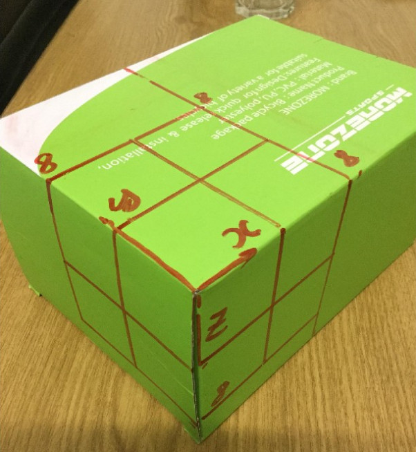

# Photogrammetry
This repository holds my my experiments about fundamental tasks in photogrammetry

## Basic Homography Math
This code consists of basic transformations on the homography representations of line and point

## Panorama

In this experiment, I stitched 3 pictures of a subject into a single panorama picture.The experiment includes the following steps
 - 3 input pictures are taken by turning camera around a common projection center so that three images do not have disparity
 - Correspondence analysis is performed by selecting feature points in 3 images in a way that they are both on common planar surface. These feature points will be used to estimate homography transformations from one image to another image. The homography is estimated using SVD.
 - Finally, image one is rectified to the plane of the image 2, and then the rectified image 2-3 is one more time rectified to the plane of the image 3.

## Camera Calibration

This experiment is about camera calibration using  direct linear transformation (DLT), which estimate the intrinsic and extrinsic camera parameters using correspondences between 3D-2D control points. The experiment include the following stages.
- Correspondence analysis: the 2D control points on image are selected manually using a Matlab tool. The corresponding 3D control points are generated in code based on the pattern that we draw on the calibration object. At least 6 point correspondences are required for the DLT algorithm.
- The projective transformation is then estimated from the correspondence points using SVD decomposition.
- In the final stage, the estimated projection is decomposed using RQ decomposition. The result of RQ decomposition include two matrices: a 3x3 matrix that represents the intrinsic parameters and a 3x4 matrix that represents the extrinsic camera parameters (rotation and translation)

## Epipolar Constraint
- In a pair of stereo images, 3D points are projected onto two corresponding points on the left and right images. The relation between these tie points are encoded in the $3\times3$ fundamental matrix $F$, which represent the relations between left points $x$ and right points $x'$ through the equation $x'^TFx$. However, due to the fact that the rank of the fundamental is just 2, it just maps one point on the left to the corresponding line on the image, as shown in the below figure.

- in this experiment, I tried to visualize the epipolar contraint on feature points through the following steps:
  - select corresponding feature points on two stereo images
  - estimate the fundamental matrix
  - using the fundamental matrix to transform each feature point into the corresponding epipolar line on the other image. The visualizaiont of these lines are shown in the below figure.

  ##
